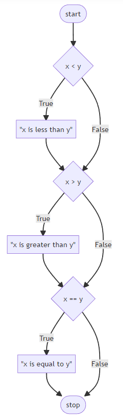
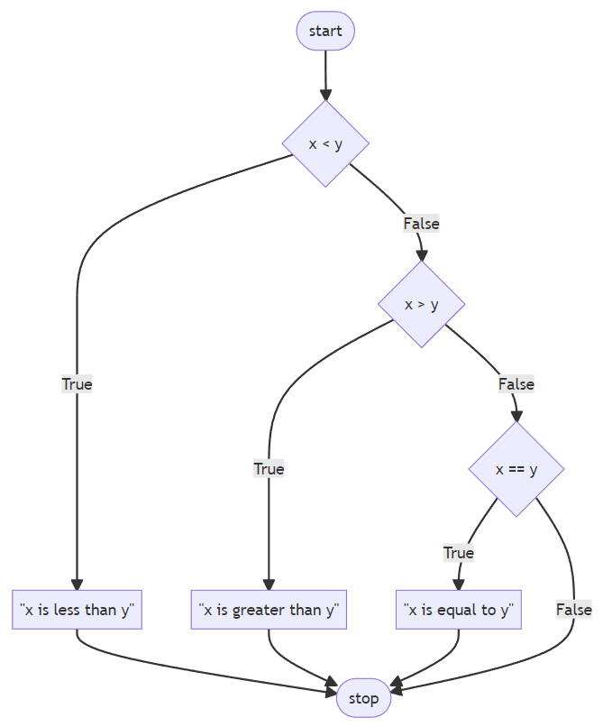
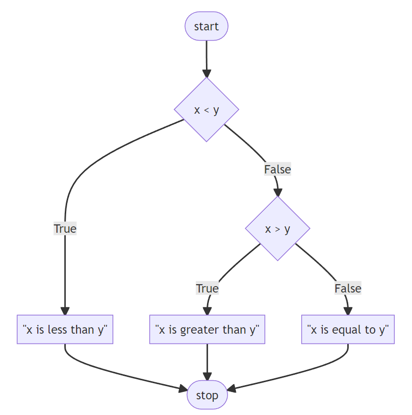

# Kiểm soát luồng trong python
## Luồng if else trong python
Trong python, chúng ta sử dụng câu lệnh if, else để thực hiện biểu thức điều kiện.
Chúng ta có các dạng viết câu lệnh điều kiện như sau: if, else và elif.
### Câu lệnh if
Cú pháp của câu lệnh if trong Python là:

    if condition:
        # body of if statement

- Nếu condition là đúng, thì đoạn mã bên dưới câu lệnh if được thực thi
- Nếu condition là sai, thì đoạn mã bên dưới câu lệnh if KHÔNG được thực thi

Ví dụ:

    x = int(input("What's x? "))
    y = int(input("What's y? "))

    if x < y:
        print("x is less than y")

Hãy chạy chương trình và nhập một giá trị x và y sao cho x < y, chúng ta sẽ thấy nó in ra màn hình "x is less than y". Nhưng nếu nhập lại sao cho x không nhỏ hơn y thì sẽ không in ra gì cả.
Ở đây câu lệnh if sẽ kiểm tra điều kiện là True hay False, nếu True thì sẽ thực hiện đoạn mã dưới if, nếu False thì không thực hiện.

### Câu lệnh elif
Bây giờ nếu chúng ta cần so sánh đa dạng hơn, có thể chúng ta sẽ viết như sau:

    x = int(input("What's x? "))
    y = int(input("What's y? "))

    if x < y:
        print("x is less than y")
    if x > y:
        print("x is greater than y")
    if x == y:
        print("x is equal to y")

Ở đây chúng ta đã đưa ra 3 câu if, chương trình sẽ đồng thời phải kiểm tra cả 3 điều kiện ở 3 dòng if này. Luồng có thể được biểu diễn như sau:

Chúng ta có thể cải thiện chương trình như sau:

    x = int(input("What's x? "))
    y = int(input("What's y? "))

    if x < y:
        print("x is less than y")
    elif x > y:
        print("x is greater than y")
    elif x == y:
        print("x is equal to y")
    
Ở đây khi sử dụng elif, chương trình sẽ có khả năng chỉ cần kiểm tra ít hơn. Ví dụ nếu if đầu tiên được kiểm tra, nếu condition là đúng thì nó sẽ không kiểm tra các condition sau. Luồng có thể được biểu diễn như sau:

Với những chương trình nhỏ thì máy tính sẽ không cảm nhận được sự khác biệt về tốc độ. Nhưng với những chương trình có hàng tỷ hoặc hàng nghìn tỷ phép tính mỗi ngày thì việc tối ưu một đoạn mã nhỏ như này sẽ mang lại ảnh hưởng có thể nhìn thấy được.
### Câu lệnh else
Bây giờ chúng ta có một cải tiến cuối cùng bằng cách sử dụng câu lệnh `else` thay thế cho việc viết `elif x == y`.
Hãy xem xét đoạn mã sau:

    x = int(input("What's x? "))
    y = int(input("What's y? "))

    if x < y:
        print("x is less than y")
    elif x > y:
        print("x is greater than y")
    else:
        print("x is equal to y")

Bởi vì việc kiểm tra liệu x có bằng y hay không sau khi đã đi qua 2 điều kiện trên là không cần thiết, bởi vì nếu không rơi vào 2 điều kiện trên thì chắc chắn x = y.

Vì vậy ở đây chúng ta thêm câu lệnh `else`, có nghĩa là nếu điều kiện phía trên không đúng, thì mặc định một cách tự động là chương trình sẽ chạy khối code ở dưới `else`.

Luồng của nó hoạt động như sau:

### If lồng nhau
Chúng ta cũng có thể sử dụng các câu lệnh if lồng trong if như sau:
    
    # outer if statement
    if condition1:
        # statement(s)

        # inner if statement
        if condition2: 
            # statement(s)

Chúng ta cùng xem xét các ví dụ sau:

    number = 5

    # outer if statement
    if (number >= 0):
        # inner if statement
        if number == 0:
        print('Number is 0')
        
        # inner else statement
        else:
            print('Number is positive')

    # outer else statement
    else:
        print('Number is negative')

    # Output: Number is positive

Trong ví dụ trên, chúng ta sử dụng câu lệnh if lồng nhau để kiểm tra xem số đã cho là dương, âm hay bằng 0.

___Lưu ý:___ sử dụng if lồng nhau có thể khiến code chúng ta khó đọc hơn, vì vậy hãy chú ý khi sử dụng nó để tránh lách các logic cần thiết.
### Một số toán tử với if
#### Or
Toán tử `or` cho phép chương trình của chúng ta kiểm tra kiểm tra cùng lúc nhiều điều kiện thành phần mà không cần phải xảy ra đồng thời.
Hãy xem xét ví dụ sau:

    x = int(input("What's x? "))
    y = int(input("What's y? "))

    if x < y or x > y:
        print("x is not equal to y")
    else:
        print("x is equal to y")

Ở đây, độ phức tạp của bài toán đã giảm đi và tốc độ tăng lên.

Chúng ta cũng có thể cải tiến đoạn mã như sau:

    x = int(input("What's x? "))
    y = int(input("What's y? "))

    if x != y:
        print("x is not equal to y")
    else:
        print("x is equal to y")

Hoặc:

    x = int(input("What's x? "))
    y = int(input("What's y? "))

    if x == y:
        print("x is equal to y")
    else:
        print("x is not equal to y")
#### And
Tương tự như `or`, toán tử `and` cho phép chương trình của chúng ta kiểm tra kiểm tra cùng lúc nhiều điều kiện thành phần mà bắt buộc phải xảy ra đồng thời.

Hãy xem xét ví dụ sau:

    score = int(input("Score: "))

    if score >= 90 and score <= 100:
        print("Grade: A")
    elif score >=80 and score < 90:
        print("Grade: B")
    elif score >=70 and score < 80:
        print("Grade: C")
    elif score >=60 and score < 70:
        print("Grade: D")
    else:
        print("Grade: F")

Không giống hầu hết các ngôn ngữ lập trình khác mà python cho phép chúng ta xâu chuỗi các điều kiện với nhau. Ví dụ chúng ta có thể cải thiện mã này như sau:

    score = int(input("Score: "))

    if 90 <= score <= 100:
        print("Grade: A")
    elif 80 <= score < 90:
        print("Grade: B")
    elif 70 <= score < 80:
        print("Grade: C")
    elif 60 <= score < 70:
        print("Grade: D")
    else:
        print("Grade: F")

Hoặc nếu xét kỹ hơn về logic, chúng ta cũng có thể viết thế này:

    score = int(input("Score: "))

    if score >= 90:
        print("Grade: A")
    elif score >= 80:
        print("Grade: B")
    elif score >= 70:
        print("Grade: C")
    elif score >= 60:
        print("Grade: D")
    else:
        print("Grade: F")

### Pythonic
Pythonic là một Idioms mô tả cách tiếp cận lập trình phù hợp với triết lý sáng lập của ngôn ngữ lập trình Python. Tức là có những cách lập trình đôi khi chỉ thấy trong lập trình Python.
Ví dụ chúng ta có một đoạn mã như thế này:

    n = int(input("n: "))

    if n % 2 == 0:
        print("Even")
    else:
        print("Odd")

Hãy cùng xem xét sửa đổi sau đây cho chương trình bên trên của chúng ta:

    n = int(input("n: "))

    print("Even" if n % 2 == 0 else "Odd")

Hoặc khi chúng ta muốn đảo giá trị của 2 biến a, b cho sẵn, thông thường chúng ta sẽ làm như sau:

    a = 1
    b = 2

    tmp = a
    a = b
    b = tmp

    print("a = {}, b = {}".format(a, b))

Nhưng chúng ta có thể sửa lại đoạn mã để nó pythonic hơn:

    a = 1
    b = 2

    a, b = b, a

    print("a = {}, b = {}".format(a, b))

## Luồng Match
Tương tự như câu lệnh `if`, `elif` và `else`, câu lệnh `match` có thể được sử dụng để kiểm tra và chạy mã khi có điều kiện khớp với các giá trị nhất định.

Cú pháp:

    match term:
        case pattern-1:
            action-1
        case pattern-2:
            action-2
        case pattern-3:
            action-3
        case _:
            action-default

Hãy xem xét ví dụ sau:

    name = input("What's your name? ")

    if name == "Harry":
        print("Gryffindor")
    elif name == "Hermione":
        print("Gryffindor")
    elif name == "Ron": 
        print("Gryffindor")
    elif name == "Draco":
        print("Slytherin")
    else:
        print("Who?")

Chúng ta nhận ra rằng ở đoạn mã này, có 3 điều kiện cùng in ra một nội dung.

Chúng ta có thể dùng `or` để cải thiện mã của mình.

    name = input("What's your name? ")

    if name == "Harry" or name == "Hermione" or name == "Ron": 
        print("Gryffindor")
    elif name == "Draco":
        print("Slytherin")
    else:
        print("Who?")

Ngoài ra chúng ta cũng có thể sử dụng câu lệnh `match` để ánh xạ tên của các nhà. Hãy xem xét đoạn mã sau:

    name = input("What's your name? ")

    match name: 
        case "Harry":
            print("Gryffindor")
        case "Hermione":
            print("Gryffindor")
        case "Ron": 
            print("Gryffindor")
        case "Draco":
            print("Slytherin")
        case _:
            print("Who?")

___Note___: 
- Biểu tượng `_` ở case cuối cùng có nghĩa là nếu không khớp với bất kỳ case nào bên trên thì luồng sẽ đi vào đây. Tương tự với `else`.
- Match statements require Python 3.10 or newer.

Chúng ta có thể cải thiện đoạn mã như sau:

    name = input("What's your name? ")

    match name: 
        case "Harry" | "Hermione" | "Ron":
            print("Gryffindor")
        case "Draco":
            print("Slytherin")
        case _:
            print("Who?")

Ở đây toán tử `|` giống toán tử `or`, cho phép chúng ta kiểm tra nhiều giá trị cùng một lúc trong một câu lệnh `case`.

## Vòng lặp

Trong python, vòng lặp được dùng để lặp lại một khối code.
Ví dụ: nếu chúng ta muốn hiển thị thông báo 100 lần thì chúng ta có thể thực hiện một vòng lặp có 100 vòng, ở mỗi vòng chúng ta in thông báo đó một lần.
Trong python, có 2 kiểu vòng lặp:
- Vòng lặp for
- Vòng lặp While

### Vòng lặp for
Vòng lặp for trong python được dùng để chạy một khối mã lặp đi lặp lại trong một số lần nhất định. Giống như C, nó cũng được sử dụng phổ biến để lặp qua các dữ liệu mảng như list, tuple, string,...
Cú pháp của vòng lặp for:

#### Vòng lặp lặp lại mảng dữ liệu.

    For item in sequence:
        # statement(s)

Đây là kiểu vòng lặp lặp lại mảng dữ liệu.
Trong đó, item là một phần tử của sequence, vòng lặp sẽ chạy từ phần tử thứ 0 tới phần tử thứ n - 1, với n là số lượng phần tử của sequence.

Hãy xem xét ví dụ sau:

    s = "Good morning"

    for c in s:
        print(c)

#### Vòng lặp lặp lại một khoảng

    For i in range(number):
        # statement(s)

Đây là kiểu vòng lặp với số lượng vòng nằm trong một khoảng xác định.
Trong đó number là số lượng vòng lặp, i là đánh số vòng lặp được thực hiện. Vòng lặp này sẽ thực hiện n vòng, tương ứng với từng vòng lặp i sẽ tăng 1 đơn vị, như vậy i sẽ tăng từ 0 tới number - 1.
Ở đây `range()` là một hàm được dựng sẵn bởi python. range(4) xác định một phạm vi chứa các giá trị 0, 1, 2, 3.

Hãy xem xét ví dụ sau:

    # use of range() to define a range of values
    values = range(4)

    # iterate from i = 0 to i = 3
    for i in values:
        print(i)

Chúng ta cũng có thể viết như sau:

    # use of range() to define a range of values

    # iterate from i = 0 to i = 3
    for i in range(4):
        print(i)

Trong một số trường hợp, chúng ta không cần sử dụng biến i để tính toán, chúng ta có thể biểu thị biến này dưới dạng `_` như sau:
    
    for _ in range(3):
        print("meow")

Trên đây chỉ là ví dụ thôi, vì thực tế, bài toán này xử lý rất đơn giản bằng cách:

    print(3*"meow")

### Vòng lặp While

Vòng lặp while trong python được sử dụng để chạy một mã cụ thể cho đến khi vẫn đáp ứng một điều kiện nhất định.

Cú pháp:

    while condition:
        # body of while loop

- Mỗi một lần chạy vòng lặp while, sẽ đánh giá điều kiện, nếu điều kiện là True, thì thực hiện đoạn mã bên trong và tiếp tục đi hết cho đến vòng tiếp theo, nếu là False thì sẽ đi ra ngoài vòng lặp.
- Quá trình này lặp lại liên tục cho đến khi điều kiện được đánh giá là False.

Hãy xem xét một số ví dụ sau:

    # program to display numbers from 1 to 5

    # initialize the variable
    i = 1
    n = 5

    # while loop from i = 1 to 5
    while i <= n:
        print(i)
        i = i + 1

Hoặc một ví dụ khác:

    current_level = 0
    final_level = 5

    game_completed = True

    while current_level <= final_level:
        if game_completed: 
            print('You have passed level', current_level)
            current_level += 1

    print('Level Ends')

#### Vòng lặp vô hạn
Nếu condition ở trong while luôn luôn trả về True, thì vòng lặp sẽ lặp vô hạn.

Cú pháp:

    # infinite while loop
    while True:
        # body of the loop
#### Vòng lặp while với else

Một vòng lặp while cũng có thể đi cùng với một khối else.
Phần else này được thực thi sau khi điều kiện condition trong vòng lặp while là False. Ví dụ:

    counter = 0

    while counter < 3:
        print('Inside loop')
        counter = counter + 1
    else:
        print('Inside else')

___Lưu ý:___ Khối else sẽ không thực thi nếu vòng lặp while bị dừng bởi câu lệnh break.

### So sánh for và while

Vòng lặp for thường được sử dụng khi biết trước số lần lặp. Ví dụ:
   
    # this loop is iterated 4 times (0 to 3)
    for i in range(4):
        print(i)

Và vòng lặp while thường được sử dụng khi không biết trước số lần lặp. Ví dụ:

    while condition:
        # body of loop