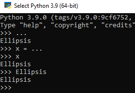

# Lập trình hướng đối tượng
Có nhiều mô hình lập trình khác nhau. Cho đến thời điểm này, chúng ta đã làm việc theo quy trình step-by-step.
Trong Python, Lập trình hướng đối tượng (OOPs) là một mô hình lập trình sử dụng các đối tượng và lớp (object và class).

## OOP
Python là một ngôn ngữ lập trình hướng đối tượng hoàn toàn, nghĩa là mọi phần tử trong chương trình Python đều là object. Một số, một chuỗi, một danh sách, v.v., mà chúng ta đã biết thực ra đều là object của một class xây dựng sẵn (int, float, str, list, v.v.). Một hàm (xây dựng sẵn hoặc do chúng ta tự xây dựng bằng từ khóa def) cũng là một object.

Như vậy, khi làm việc với Python từ đầu đến giờ, trên thực tế là chúng ta đã trực tiếp sử dụng class và object.

Python cho phép người lập trình tự xây dựng class riêng của mình.
## Class
Class là gì?

Class là một trong những khái niệm đầu tiên và chủ chốt khi nhắc đến lập trình hướng đối tượng.

Một class, lớp, là một nguyên mẫu mà từ đó các đối tượng, hay object được tạo ra. 

Chúng ta có thể tạo một class có tên là Student như sau:

    class Student:
        ...

- Dấu chấm lửng `...` sẽ nói cho chương trình biết chúng ta đang tạm bỏ qua phần này và sẽ quay lại sau. Trong python `...` được ước tính bằng với `Ellipsis`, nó là một hằng số được tích hợp sẵn, nên chúng ta có thể viết `Ellipsis` hoặc chỉ cần viêt là `...`.

Class trong Python được khai báo với từ khóa class theo cấu trúc như sau:

    class Student:
        # code

Ví dụ: Tạo các class trống trong python

    class Student:
        pass

    class Teacher:
        ...

    class Eexam:
        Ellipsis

Lưu ý: theo chuẩn PEP8 về đặt tên của lớp (class) thì nên được viết theo kiểu CapWords. Ví dụ là AnonymousUser, SuperUser,...

## Objects
Khi chúng ta tạo class, và sử dụng class đó làm nguyên mẫu để tạo ra các thực thể cụ thể, thì các thực thể đó được gọi là các object.

Ví dụ về các object:

    student1 = Student()
    student2 = Student()

Dễ thấy rằng, lệnh tạo object không khác biệt gì so với lời gọi hàm thông thường.

## Các thành phần chính trong một class
Mặc dù chúng ta có thể khai báo một class hoàn toàn không chứa thành viên nào, class như vậy không có giá trị. Class trong Python thường chứa những thành phần sau:

- Các attribute (biến)
- Constructor (hàm tạo)
- Các method (phương thức)
- Các property (thuộc tính)

Chúng ta sẽ học cụ thể về nó ở những phần kế tiếp.

## Attribute
Để hiểu attribute là gì, cùng sửa đổi chương trình của chúng ta như sau:

    class Student:
        ...

    student1 = Student()
    student1.name = input("Name: ")
    student1.house = input("House: ")
    print(f"{student1.name} from {student1.house}")

    student2 = Student()
    print(f"{student2.name} from {student2.house}")

Chúng ta truy cập tới các attribute của một object bằng cách dùng dấu `.`.

Chúng ta đã tạo 2 object là student1 và student2. Khi chúng ta cố gắng truy xuất và in ra name và house của student 1 thì chương trình đã in ra thành công, nhưng khi cố gắng làm tương tự vói student2 thì chương trình báo lỗi.

Vì object student1 có 2 attribute là name và house được tạo trong hàm get_student (hoàn toàn nằm ngoài class), còn object student2 thì không có.

=> Trong Python, attribute là những biến có thể chứa giá trị đặc trưng cho một object.
=> Nó có thể được tạo hoàn toàn độc lập với khai báo class (không bắt buộc phải chỉ định trong khai báo class).

## Hàm constructor \__init__
Từ ví dụ trên, chúng ta thấy các object khác nhau có thể có attribute khác nhau bằng cách chỉ định bên ngoài object như thế này:

    class Student:
        ...

    student1 = Student()
    student1.name = input("Name: ")
    student1.house = input("House: ")
    print(f"{student1.name} from {student1.house}")

    student2 = Student()
    student2.age = 12
    print(f"{student2.age}")

Vậy trong trường hợp các object cùng có các attribute giống nhau, và class có trăm, nghìn object? Việc gán bằng tay không phải là một cách tốt.

Vì vậy, python cung cấp method `__init__`, là method constructors. Chúng ta không cần phải gọi nó, nó sẽ được tự động gọi ngay khi một object của một class được khởi tạo.

Nó là một khuôn mẫu để mỗi khi tạo object chúng ta phải là theo để các object được tạo ra có các loại attribute giống nhau.

Ví dụ:

    class Student:
        def __init__(self, name, house):
            self.name = name
            self.house = house

- `name` và `house` là hai attribute của class Student.
- `self` là từ khóa dùng đề cập tới chính object đó.
- Ở trong hàm `__init__`, chúng ta đã yêu cầu khi tạo một object từ class Student, phải truyền name và house, vì vậy cách tạo một object trước đó

    student = Student()

sẽ gây lỗi:

    TypeError: __init__() missing 2 required positional arguments: 'name' and 'house'

mà cần viết là:

    student = Student(name="Anna", house="house")

hoặc chỉ cần viết ngắn gọn hơn:

    student = Student("Anna", "house")

Nếu chúng ta muốn khi tạo các object từ class Student không bắt buộc truyền name và house, thì chúng ta có thể không viết method `__init__`, hoặc vẫn viết method `__init__` nhưng sử dụng default arguments. Ví dụ:

    class Student:
        def __init__(self, name="Default name", house="Default house"):
            self.name = name
            self.house = house

    student1 = Student()
    print(f"{student1.name} from {student1.house}")

    student2 = Student("Anna", "Gryffindor")
    print(f"{student2.name} from {student2.house}")

## 2 loại Attribute
### Instance Attribute
Trong Python, các attribute được khai báo trong hàm tạo `__init__` của class được gọi là instance attribute. Đây là các giá trị đặc trưng cho từng object. Ví dụ, class Student xác định rằng, tất cả học sinh được đặc trưng bởi name, house.

Chú ý:
- Instance Attribute được tạo ra trong hàm tạo `__init__` chứ không viết trong thân class. Biến được khai báo trong thân class lại thuộc về nhóm class instance (chúng ta sẽ học sau).
- Instance Attribute được khai báo cùng với tham số `self`.

#### Truy xuất instance attribute
Với các instance attribute tạo ra như trên, chúng ta có thể truy xuất nó qua tên object trong code ở ngoài class, việc truy xuất là 2 chiều, tức chúng ta có thể gán và thay đổi giá trị.

    class Student:
        def __init__(self, name="Default name", house="Default house"):
            self.name = name
            self.house = house

    student1 = Student()
    print(f"{student1.name} from {student1.house}")
    student1.name = "Anna"
    print(f"{student1.name} from {student1.house}")

### Class Attribute
Hình dung bài toán sau: sau khi tạo class Student, làm thế nào để theo dõi số lượng object đã tạo ra?

Logic đơn giản nhất là tạo ra một biến đếm. Mỗi khi tạo một object mới thì tăng giá trị của biến đếm. Nếu biến đếm và việc tăng giá trị của biến đếm nằm ngoài class thì rất đơn giản. Nhưng nếu chúng ta cần tích hợp logic này vào chính class thì làm như thế nào?

Chúng ta thấy rằng, biến đếm trên không thể phục thuộc vào từng object. Nói cách khác, tất cả các object đều phải dùng chung một biến đếm.

Python cung cấp một một công cụ lá class attribute để thực hiện điều này.

    class Student:
        count = 0

        def __init__(self, name="Default name", house="Default house"):
            self.name = name
            self.house = house
            Student.count += 1

    student1 = Student()
    print(Student.count, student1.count)
    student2 = Student()
    print(Student.count, student2.count)
    student3 = Student()
    print(Student.count, student3.count)

=> Như vậy, class attribute là một biến gắn liền với chính class, có thể được truy xuất từ các object hoặc từ chính class và có giá trị chung cho tất cả các object.

#### Cập nhật giá trị class attribute
Tương tự instance attribute, chúng ta cũng có thể thay đổi giá tị của class attribute.

    class Student:
        count = 0

        def __init__(self, name="Default name", house="Default house"):
            self.name = name
            self.house = house
            Student.count += 1

    student1 = Student()
    print(Student.count, student1.count)
    student2 = Student()
    print(Student.count, student2.count)
    student3 = Student()
    print(Student.count, student3.count)
    Student.count = 0
    print(Student.count, student1.count, student2.count, student3.count)

Output:

1 1
2 2
3 3
0 0 0 0

=> Khi thay đổi giá trị class attribute thông qua Class thì thuộc tính đó ở object cũng bị đổi theo.

Hãy thử trường hợp thay đổi từ object:

    class Student:
        count = 0

        def __init__(self, name="Default name", house="Default house"):
            self.name = name
            self.house = house
            Student.count += 1

    student1 = Student()
    print(Student.count, student1.count)
    student2 = Student()
    print(Student.count, student2.count)
    student3 = Student()
    print(Student.count, student3.count)
    student1.count = 0
    print(Student.count, student1.count, student2.count, student3.count)
    Student.count = 2
    print(Student.count, student1.count, student2.count, student3.count)

Output:
    1 1
    2 2
    3 3
    3 0 3 3
    2 0 2 2

=> Khi thay đổi giá trị class attribute thông qua object thì chỉ có object đó thay đổi, và kể từ đó khi thay đổi từ class thì object đó không bị ảnh hưởng theo.
## Method
Xem xét bài toán điểm danh học sinh:

    class Student:
        count = 0

        def __init__(self, name, house):
            self.name = name
            self.house = house
            Student.count += 1
        
    def attendance(name):
        print(f"{name} is here!")

    student1 = Student("Lan", "Gryffindor")
    student1.check = attendance
    student1.check(student1.name)
    student2 = Student("Minh", "Gryffindor")
    student2.check(student2.name)

Ở đây dòng mã `student1.check(student1.name)` sẽ in ra màn hình `Lan is here!` còn dòng mã `student2.check(student2.name)` sẽ báo lỗi `'Student' object has no attribute 'check'`.

Như vậy giống như attribute, cách viết trên không thỏa mãn rằng tất các các học sinh đều có thể thực hiện chức năng điểm danh, mà phải chủ động khai báo sau khi đã tạo object.

Để khiến cho các object có cùng các method ngay sau khi khởi tạo, chúng ta có thể khai báo các method trong thân class.

Method là một phần của Object (method chính là hành động của object). Hay nói cách khác, method nằm bên trong class và có thể xử lý dữ liệu được chứa bên trong class.

Khi tạo một class bất kỳ, python tích hợp sẵn một số method, hoặc chúng ta cũng có thể tự tạo các method cho riêng mình.

#### Instance method
Chúng ta sửa đoạn mã trên như sau:

    class Student:
        count = 0

        def __init__(self, name, house):
            self.name = name
            self.house = house
            Student.count += 1
        
        def attendance(self):
            print(f"{self.name} is here!")

    student1 = Student("Lan", "Gryffindor")
    student1.attendance()
    student2 = Student("Tuan", "Gryffindor")
    student2.attendance()

Ở đây, chúng ta tạo method attendance có tham số là self dùng để chỉ tới một object, trong method, chúng ta truy cập tới attribute name của object.

Method attendance trên đây là một instance method.

Instance method trong Python là những phương thức có khả năng truy xuất trạng thái của object. Nhắc lại: trạng thái của object trong Python được lưu trữ trong các instance attribute (biến thành viên).

Lưu ý:
- Danh sách tham số của instance method tương tự của hàm, nhưng cần có từ khóa `self`. Nếu có nhiều tham số, `self` phải là tham số đầu tiên được liệt kê.
- Có thể truy xuất attribute trong chính instance method thông qua từ khóa `self`.

#### Class method
Trong phần trước chúng ta đã làm quen với class attribute – loại biến chứa giá trị đặc trưng cho class và gắn với class, thay vì gắn với object. Một ví dụ đã được đưa ra để minh họa là đếm số lượng object của class đã được khởi tạo trong chương trình.

Class method cũng có cùng ý tưởng với class attribute. Class method là những phương thức đặc trưng cho class và gắn liên với class, thay vì gắn với object. Class method có nhiệm vụ xử lý dữ liệu lưu trong class attribute.

Ví dụ:

    class Student:
        count = 0

        def __init__(self, name, house):
            self.name = name
            self.house = house
            Student.count += 1
        
        def attendance(self):
            print(f"{self.name} is here!")

        @classmethod
        def show_count(cls):
            print(cls.count)
    

    student1 = Student("Lan", "Gryffindor")
    student1.show_count()
    student2 = Student("Tuan", "Gryffindor")
    student2.show_count()
    Student.show_count()

`@classmethod` là một decorator. Decorator là một loại hàm đặc biệt có thể nhận một hàm khác làm tham số để bổ sung tính năng cho hàm tham số đó. Chúng ta sẽ quay lại học chi tiết về decorator trong phần dưới.

Để tạo ra class method, chúng ta sử dụng decorator @classmethod.

Class method cũng bắt buộc phải có một biến đặc biệt trong danh sách tham số: biến cls (viết tắt của class). Biến này có vai trò tương tự như biến self của instance method. Điểm khác biệt nằm ở chỗ biến cls chứa thông tin về chính class.

Trong ví dụ trên, count là một class attribute – chứa thông tin về chính class. Do vậy, có thể truy xuất count qua biến cls. Trên thực tế, bạn có thể hình dung truy xuất qua biến cls cũng chính là truy xuất qua tên class. Tức là `cls.count` tương đương với `Student.count`.

Ngoài Instance method và class method, python còn có static method. Chúng ta sẽ tìm hiểu ở những bài sau.

## Public, protected, private trong Python
Trong các ngôn ngữ hướng đối tượng truyền thống như C++, Java hay C#, mỗi thành viên của object về một trong các mức truy cập sau:
- (1) public: tự do truy cập, không có giới hạn gì.
- (2) protected: chỉ class con và trong nội bộ class mới có thể truy cập.
- (3) private: giới hạn truy cập trong nội bộ class.

Trong Python không có khái niệm về kiểm soát truy cập các thành viên như vậy. Hoặc cũng có thể nói rằng mặc định mọi thành viên của class trong Python đều là public. Nghĩa là code ngoài class có thể tự do truy cập các thành viên này.

Để mô phỏng lại hiệu quả của việc kiểm soát truy cập, Python sử dụng loại kỹ thuật có tên gọi là xáo trộn tên (name mangling)

Kỹ thuật này quy ước rằng:
- Nếu muốn biến chỉ được sử dụng trong nội bộ class và các class con (mức truy cập là protected), tên biến cần bắt đầu là _ (một dấu gạch chân);
- Nếu muốn biến chỉ được sử dụng trong nội bộ class (mức truy cập private), tên biến cần bắt đầu là __ (hai dấu gạch chân).

Thực ra, loại kỹ thuật này không làm thay đổi được việc truy cập thành viên của class. Nó đơn thuần là chỉ báo để lập trình viên và IDE biết ý định sử dụng của thành viên đó.

    class Student:
        def __init__(self):
            self.__private = False

    s = Student()

Ví dụ, trong class Student như trên, thực tế biến __private  không hề trở thành private. IDE sẽ trợ giúp che đi biến này trong phần nhắc code. Tuy nhiên bạn vẫn có thể truy xuất nó như bình thường:

    class Student:
        def __init__(self):
            self.__private = False

    s = Student()
    s.__private = True

#### Method \__str__
Đây là một method được tích hợp sẵn bởi python.

Với code trước đó, hay thử sửa đổi hàm main để in ra object đã tạo:

    def main():
        student = get_student()
        print(student)

Output:

    <__main__.Student object at 0x000002AA47064FD0>

Python tích hợp sẵn method `__str__` để in ra một số nội dung của object.

    class Student:
        def __init__(self, name, house, patronus):
            self.name = name
            self.house = house
            self.patronus = patronus

        def __str__(self):
            return f"{self.name} from {self.house}"

    def main():
        student = get_student()
        print(student)

    def get_student():
        name = input("Name: ")
        house = input("House: ")
        patronus = input("Patronus: ")
        return Student(name, house, patronus)

    if __name__ == "__main__":
        main()

Output:

    Name: Anna
    House: a1
    Patronus: 5
    Anna from a1

## Property
Property là một loại thành viên đặc biệt trong class Python cho phép truy xất và kiểm soát truy xuất một (instance) attribute cụ thể. Property rất quan trọng và được khuyến khích sử dụng khi xây dựng các class chuyên để chứa dữ liệu. Python cung cấp một số cách khác nhau để khai báo property.

### Mô hình getter/setter
Trong class python, dù có cách viết __ và _, nhưng về bản chất, mọi thành viên của class đều là public và có thể truy xuất tự do.

Điều này sinh ra một vấn đề là kiểm sóat dữ liệu. Ví dụ: tuổi của con người không thể âm.

Để kiểm soát việc nhập xuất dữ liệu cho các opject, không chỉ python, mà các ngôn ngữ lập trình hướng đối tượng thường sử dụng mô hình getter/setter. Ví dụ trên class Student:

